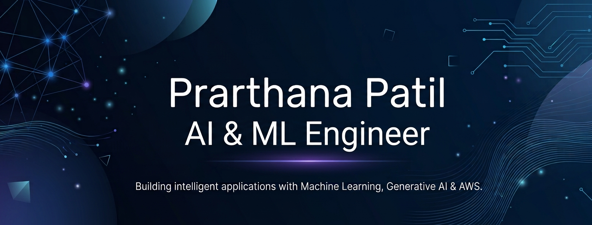

  

🎓 Computer Science Engineering (AI & ML) Graduate

I'm an AI & ML enthusiast focused on building intelligent applications using Machine Learning, Deep Learning, Large Language Models (LLMs), Generative AI, and AWS. I enjoy developing scalable AI solutions that solve real-world problems.

## 🧠 Interests

- Artificial Intelligence
- Machine Learning
- Deep Learning
- Generative AI
- Large Language Models (LLMs)
- Retrieval-Augmented Generation (RAG)

## ⚙️ Tech Stack

**Languages:** Python, SQL

**AI/ML:** Scikit-learn, TensorFlow, Pandas, NumPy, Generative AI, LLMs, RAG

**Cloud:** AWS (EC2, S3, RDS, Lambda)

## 🌱 Currently Learning

- AI Agents
- MLOps
- Advanced LLM Applications

## 📫 Connect with Me

- Email: *patilprarthana890@gmail.com*
